# Architecture Overview

This document explains how OAuth2, OIDC, JWT, Spring Security, and Swagger work together in this application.

## Table of Contents

1. [High-Level Architecture](#high-level-architecture)
2. [OAuth2 & OIDC Flow](#oauth2--oidc-flow)
3. [Component Breakdown](#component-breakdown)
4. [Security Layer](#security-layer)
5. [Data Flow](#data-flow)
6. [Session Management](#session-management)

## High-Level Architecture

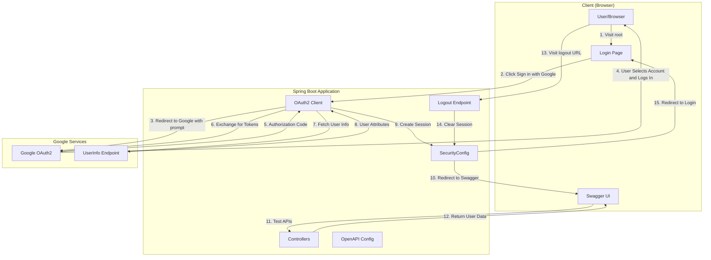

## OAuth2 & OIDC Flow

### The Complete Authentication Journey

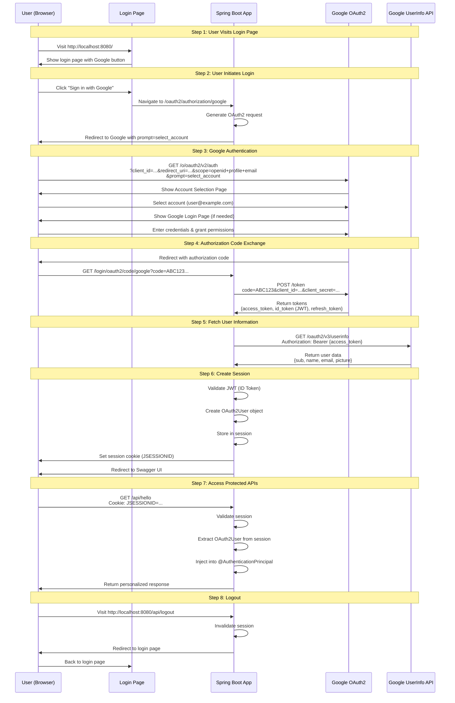

### What is OIDC?

**OpenID Connect (OIDC)** is an identity layer on top of OAuth2. It adds:

- **ID Token**: A JWT containing user identity information
- **UserInfo Endpoint**: Standardized endpoint for user profile data
- **Standard Claims**: Predefined fields like `name`, `email`, `picture`

In this app, when you request the `openid` scope, you're using OIDC!

### What is JWT?

**JSON Web Token (JWT)** is a compact, URL-safe token format. The `id_token` from Google is a JWT.

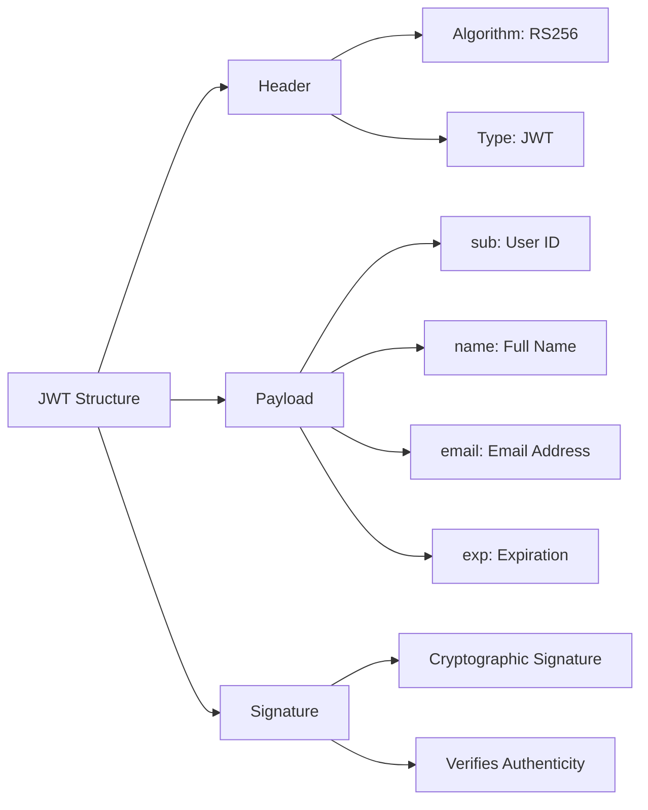

Spring Security automatically:
- Validates the JWT signature
- Extracts user information
- Creates an `OAuth2User` object

## Component Breakdown

### Architecture Components

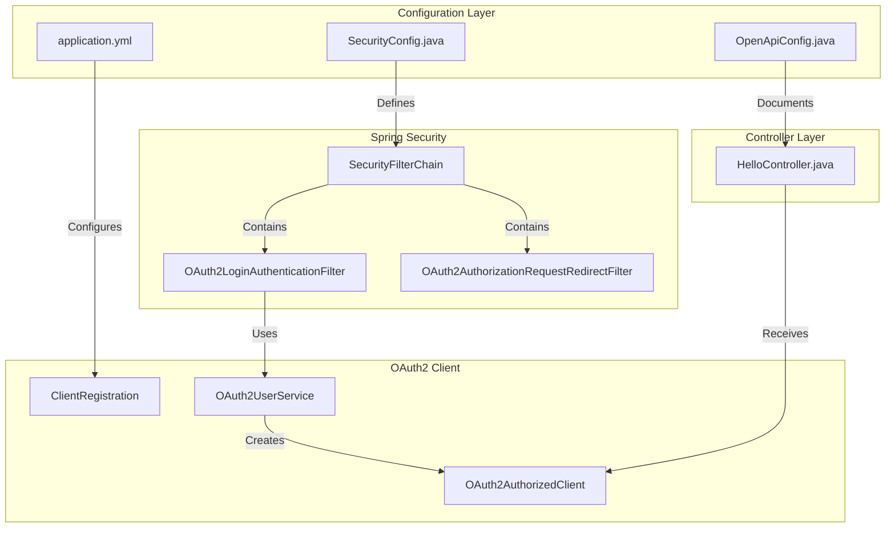

### 1. SecurityConfig.java

**Purpose**: Defines security rules for the application.

```java
.requestMatchers("/api/**").authenticated()
```
- All `/api/**` endpoints require authentication
- Swagger UI is public (so you can access it before logging in)
- OAuth2 login is enabled

**Key Concept**: This is the "bouncer" at the door. It checks if you're logged in before letting you access protected endpoints.

### 2. OpenApiConfig.java

**Purpose**: Configures Swagger UI with clear authentication instructions.

Provides users with step-by-step instructions on how to authenticate using Spring Security's OAuth2 login flow.

### 3. HelloController.java

**Purpose**: Example API endpoints demonstrating authentication.

```java
public Map<String, Object> hello(@AuthenticationPrincipal OAuth2User principal)
```

**The Magic**: `@AuthenticationPrincipal` automatically injects the authenticated user!

Spring Security:
1. Checks the session cookie
2. Finds the authenticated user
3. Injects it as the `principal` parameter

No manual token parsing needed!

### 4. application.yml

**Purpose**: OAuth2 client configuration.

```yaml
spring:
  security:
    oauth2:
      client:
        registration:
          google:
            client-id: ${GOOGLE_CLIENT_ID}
            client-secret: ${GOOGLE_CLIENT_SECRET}
            scope: [openid, profile, email]
```

This tells Spring:
- "I want to use Google as an OAuth2 provider"
- "Here are my credentials"
- "Request these scopes"
- "Use this redirect URI"

## Security Layer

### How Spring Security Protects Your API

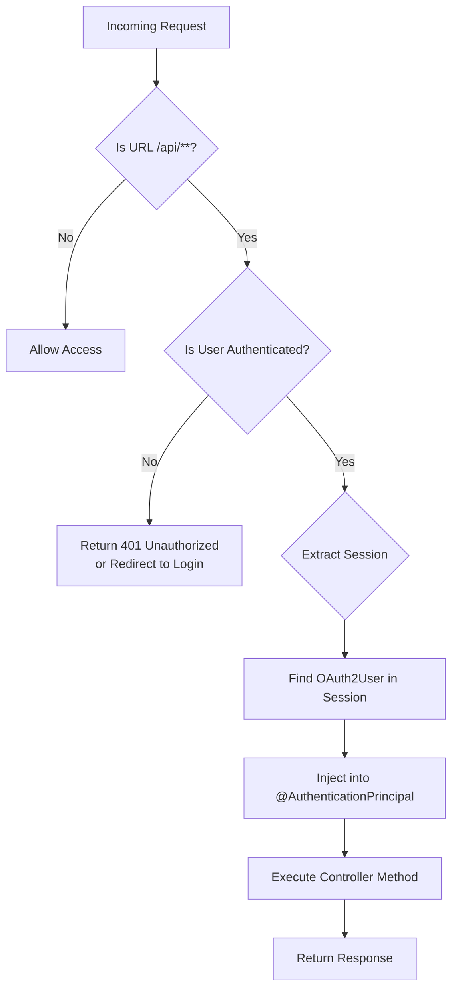

### Session Management

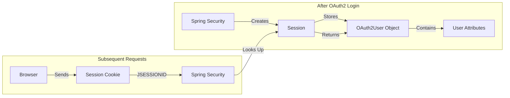

After successful OAuth2 login:
1. Spring creates a session
2. Session ID stored in cookie: `JSESSIONID`
3. Session contains `OAuth2User` object
4. Subsequent requests include the cookie
5. Spring looks up the session and finds the user

**Important**: The JWT is validated once during login. After that, the session cookie is used.

## Data Flow

### Complete Request Flow for GET /api/hello

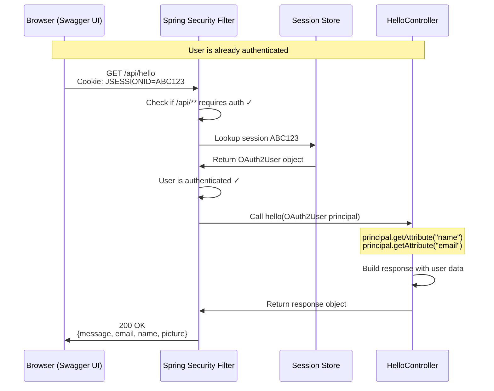

### Authentication State Diagram

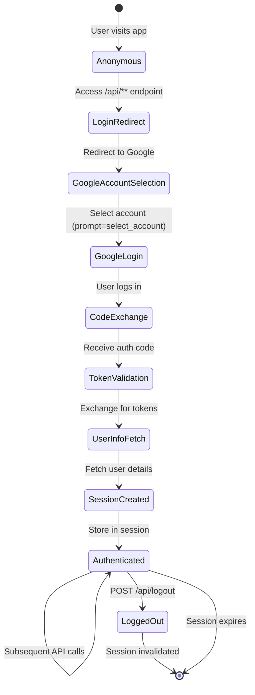

## Key Concepts Explained

### OAuth2 vs OIDC vs JWT

| Concept | What It Is | Role in This App |
|---------|-----------|------------------|
| **OAuth2** | Authorization framework | Allows app to access Google on your behalf |
| **OIDC** | Identity layer on OAuth2 | Provides user identity information |
| **JWT** | Token format | Google's ID token is a JWT |

### Scopes Explained

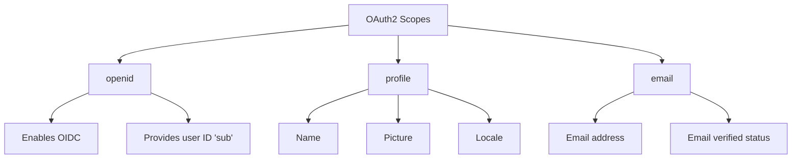

### Spring Security Auto-Magic

Spring Security automatically handles:
- ✅ Redirect to Google
- ✅ Authorization code exchange
- ✅ Token validation
- ✅ User info fetching
- ✅ Session management
- ✅ CSRF protection
- ✅ Security headers

You just configure it and use `@AuthenticationPrincipal`!

## Security Considerations

### What's Protected

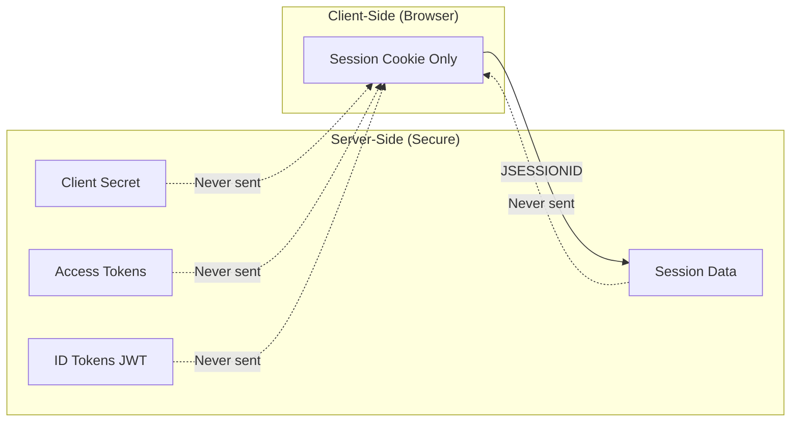

1. **Client Secret**: Never exposed to browser
2. **Tokens**: Stored server-side in session
3. **API Endpoints**: Protected by authentication
4. **CSRF**: Enabled by default in Spring Security

### What's Public

1. **Swagger UI**: Must be public to show documentation
2. **OAuth2 endpoints**: Spring's built-in login/callback URLs
3. **Static resources**: If you add any

### Production Checklist

- [ ] Use HTTPS (not HTTP)
- [ ] Set secure session cookies
- [ ] Use environment variables for secrets
- [ ] Configure CORS properly
- [ ] Add rate limiting
- [ ] Enable security headers
- [ ] Use production OAuth2 credentials
- [ ] Remove debug logging
- [ ] Set session timeout appropriately
- [ ] Implement logout functionality

## Testing the Application

### Step-by-Step Testing Flow

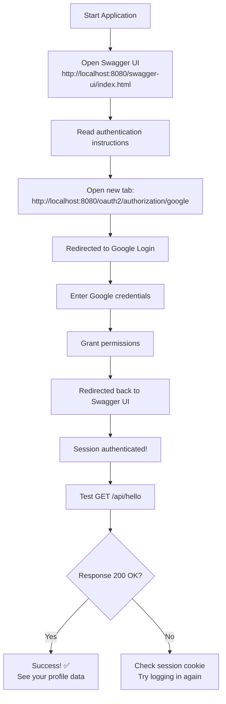

## Debugging Tips

### Enable Debug Logging

Already enabled in `application.yml`:
```yaml
logging:
  level:
    org.springframework.security: DEBUG
    org.springframework.security.oauth2: DEBUG
```

### Common Issues

| Issue | Cause | Solution |
|-------|-------|----------|
| 401 Unauthorized | Not authenticated | Visit /oauth2/authorization/google to log in |
| redirect_uri_mismatch | Wrong redirect URI | Check Google Console config |
| Invalid client | Wrong credentials | Verify CLIENT_ID and SECRET |
| Session expired | Session timeout | Re-authenticate |

## Further Reading

- [Spring Security OAuth2 Docs](https://docs.spring.io/spring-security/reference/servlet/oauth2/index.html)
- [OAuth2 RFC 6749](https://tools.ietf.org/html/rfc6749)
- [OpenID Connect Spec](https://openid.net/connect/)
- [JWT Introduction](https://jwt.io/introduction)
- [SpringDoc OpenAPI](https://springdoc.org/)

---

**Questions?** Review the code in `src/main/java/com/example/oauth2/` to see these concepts in action!
