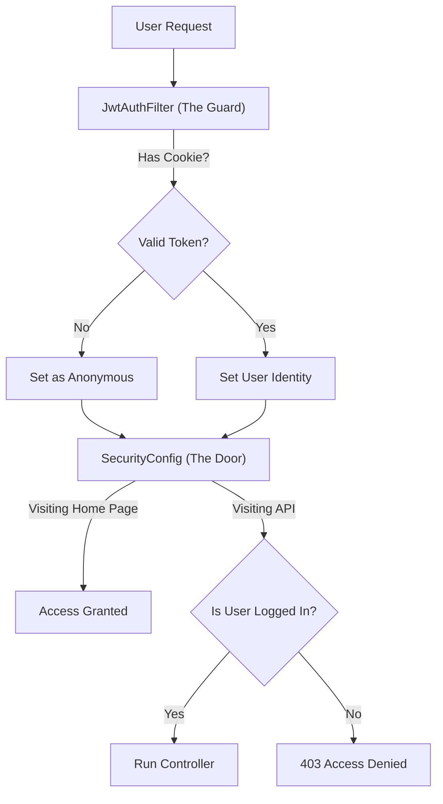

# Application Code Flow (Simplified)

This guide explains how users log in and how the application secures pages.

## 1. Login Flow (Getting In)

When a user clicks "Login with Google", this specific sequence happens:

1.  **Google Login**: The user authenticates with Google.
2.  **Success Handler**: Spring automatically runs `OAuth2SuccessHandler.java` on success.
3.  **Token Creation**: We generate a **JWT (JSON Web Token)** containing the user's email/name.
4.  **Cookie Storage**: We save this JWT into an **HTTP-Only cookie** named `auth_token`.
5.  **Redirect**: The user is sent to the home page (or Swagger), now carrying that cookie.

---

## 2. Security Flow (The "Guard" & "Door" Analogy)

Security is split into two parts: **The Guard** (Filter) and **The Door** (Configuration).

### Part A: The Guard (JwtAuthFilter)
Imagine a security guard at the building's main entrance.
*   **Action**: The guard stops **every single request**—whether you are going to the lobby (Public) or the CEO's office (Private).
*   **Check**: The guard asks, *"Do you have a cookie badge?"*
    *   **Yes**: "Okay, I see you are **User: Alice**. You may proceed."
    *   **No**: "Okay, I don't know you. You are **Guest**. You may proceed."

### Part B: The Door (SecurityConfig)
After the guard lets you through, you try to open a specific door (URL).
*   **Public Room (e.g., Home Page `/`)**:
    *   The sign says: **"Everyone Welcome"** (`.permitAll()`).
    *   **Result**: Both **Alice** and **Guest** can enter.
*   **Private Room (e.g., `/api/hello`)**:
    *   The sign says: **"Authorized Personnel Only"** (`.authenticated()`).
    *   **Result**:
        *   **Alice** enters successfully.
        *   **Guest** is stopped by the lock (403 Forbidden Error).

---

## 3. Visualizing the Logic

---

## 4. Key Concepts

### Q: Does it really check *every* request?
**Yes.** Even if you have 100 different API endpoints (`/api/users`, `/api/orders`), the Filter checks the cookie first for every single one. This ensures security is consistent.

### Q: Do the Controllers know about this?
**No.** `HelloController.java` is unaware of the security checks. It assumes that if the code is running, the user must have already passed the security guard.

### Q: What happens with Tabs vs. Browsers?
*   **New Tab**: You remain **Logged In**. Cookies are shared across tabs in the same browser.
*   **Different Browser** (e.g., switching from Chrome to Safari): You will be **Logged Out**. Cookies are stored in the browser's local pocket and are not shared.

---

## 5. Component Summary

| Component | Analogy | Responsibility |
| :--- | :--- | :--- |
| **SecurityConfig** | **The Rulebook** | Defines which pages are public vs. private. |
| **OAuth2SuccessHandler** | **The Welcomer** | Gives the user their ID badge (Cookie) after they arrive from Google. |
| **JwtAuthFilter** | **The Guard** | Checks ID badges (Cookies) on every single request. |
| **HelloController** | **The Destination** | The actual room/code the user wants to reach. |
